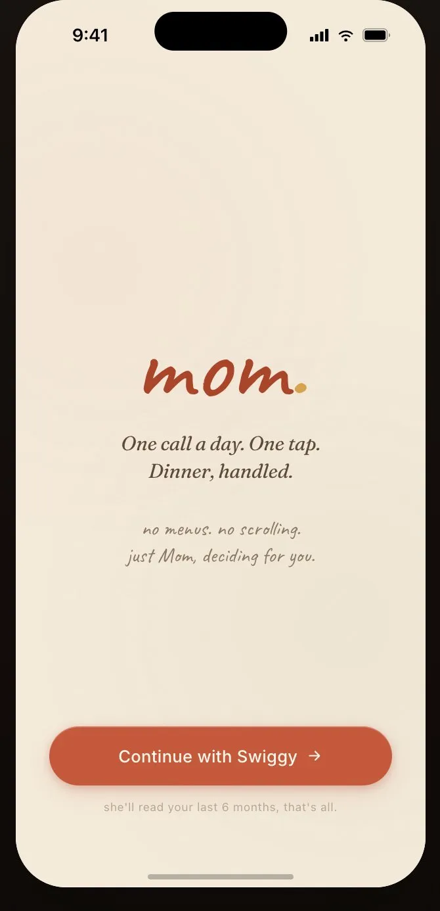
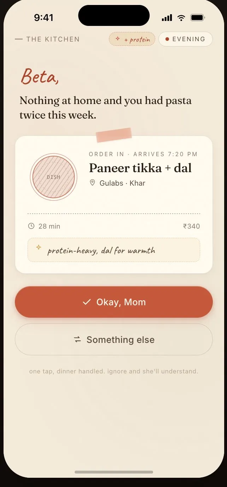
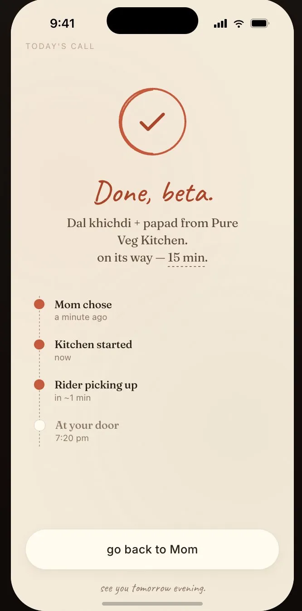
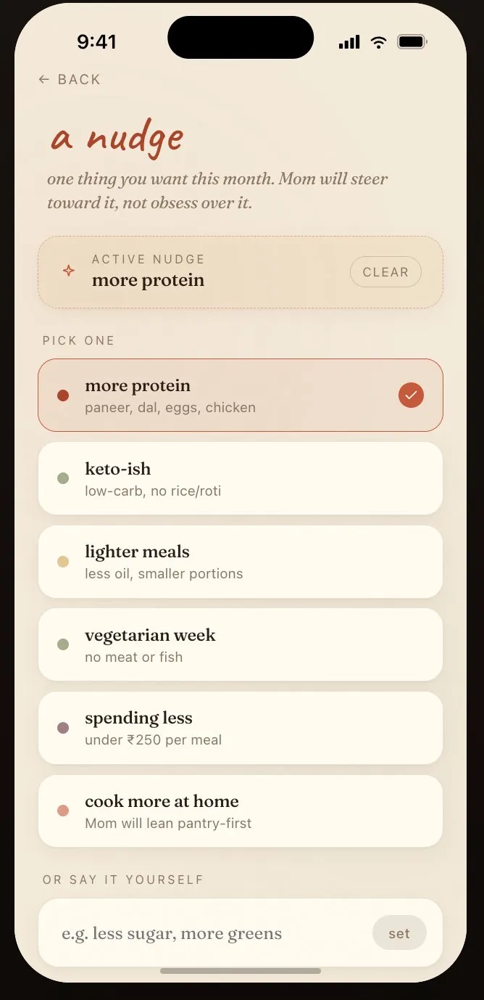
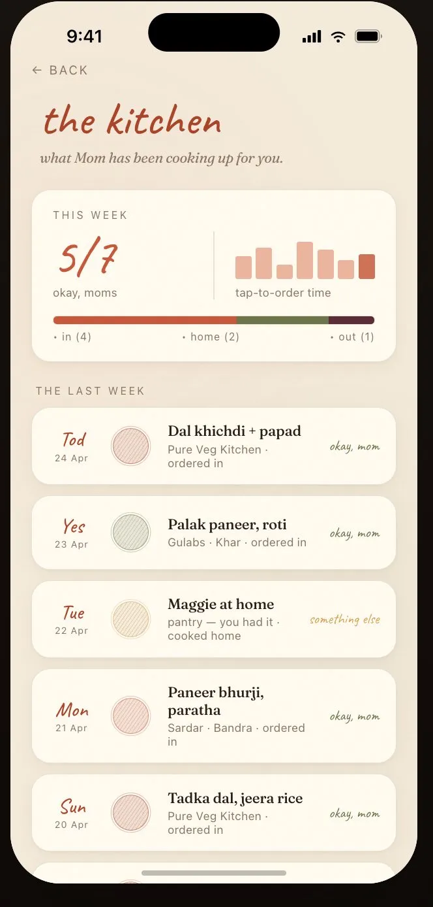

# bawarchi.

> *One nudge. One tap. Meals, handled.*

---

## The Problem

I'm 24, living in Bangalore with friends. Most evenings — especially weekends or when the cook doesn't show up — the question *"what do we eat tonight?"* becomes a 30-minute rabbit hole of scrolling through Swiggy, opening menus, closing them, second-guessing, and eventually ordering something mediocre out of exhaustion.

The decision fatigue is real. I know roughly what I want — maybe something lighter this week, maybe more protein — but translating that vague feeling into an actual order across hundreds of restaurants is draining.

What I actually want is my bawarchi. They know what I've been eating. They know when I'm being lazy vs. when I'm trying to be healthy. They'd just call and say: *"Aaj ke liye, this one."* And I would. No friction.

---

## The Solution

**bawarchi.** is an AI agent that acts like the household cook who already knows what you should eat.

It connects to Swiggy at runtime, maintains its own food context from your nudges and feedback, and nudges you at the meal times you choose with **one suggestion** — not a list, not a menu, just one thing. You tap *Okay, Bawarchi* to review and confirm the order. If it's off, you tap *Something else* and get one alternative. That's it.

It works across:
- **Order In** — Swiggy food delivery
- **Dine Out** — a nearby restaurant suggestion if you're stepping out

Every choice (accept or reject) teaches it more. Bawarchi gets smarter.

---

## Screens

| Screen | What it does |
|---|---|
| **Splash** | Connects with your Swiggy account. |
| **The Suggestion** | One meal recommendation, personalized reasoning, ETA + price. Accept or ask for something else. |
| **Pakka.** | Order confirmed. Live tracking in Bawarchi's voice. |
| **A Nudge** | Configure when Bawarchi should call, what they should keep in mind, and the comfortable budget. |
| **The Kitchen** | Weekly context view. What Bawarchi suggested, what you accepted/rejected, and your evolving patterns. |

### Preview

<table>
  <tr>
    <td align="center"><br/><sub><b>Splash — Onboarding</b></sub></td>
    <td align="center"><br/><sub><b>The Suggestion</b></sub></td>
    <td align="center"><br/><sub><b>Pakka.</b></sub></td>
    <td align="center"><br/><sub><b>A Nudge</b></sub></td>
    <td align="center"><br/><sub><b>The Kitchen</b></sub></td>
  </tr>
</table>

---

## Technical Overview

The goal: feel like magic. Work on first principles. Stay embarrassingly simple under the hood.

### 1. Context Foundation — "What does Bawarchi know about this person?"

**On signup**, keep the setup to three decisions:
1. **Connect Swiggy** — OAuth + saved address resolution
2. **When should Bawarchi nudge?** — frequency + meal window
3. **What should Bawarchi keep in mind?** — one food goal + optional budget comfort

The schedule input should feel like setting an alarm, not filling a diet form:

| Input | Presets | Stored as |
|---|---|---|
| Frequency | Everyday, Weekends, Custom days | `frequency` + `days` |
| Meal windows · multi-select | Breakfast, Lunch, Dinner, Custom — each with its own time | `meals[]` with per-meal `local_time` |
| Food goals · pick up to 3 | Protein-heavy, Light meal, High fiber, Spend less, Cook more, Vegetarian, Custom (exclusive) | `active_goals[]` (max 3) |
| Budget | No limit, Under ₹300, Under ₹400, Custom | `budget_cap_inr` or `null` |

Good default: **Everyday Dinner at 7:00 PM, no budget cap**. Multi-meal example: lunch at 1:30 + dinner at 7. Goals are capped at 3 to prevent conflicting nudges (e.g. "spend less + cook more + vegetarian + protein" would paralyze Bawarchi). **Custom is exclusive** — if the user picks "Something else", they can't combine it with presets, because we treat their free-text intent as the whole instruction.

After that, Bawarchi learns only from interactions inside the app:
- Suggestions shown
- Accept/reject/ignore signals
- Alternative requests
- Orders placed through Bawarchi
- Nudge changes over time

Store this as a lightweight **food context** — a structured JSON blob, not a vector DB. Keep it human-readable.

```
{
  "schedule": {
    "frequency": "everyday",
    "days": ["mon", "tue", "wed", "thu", "fri", "sat", "sun"],
    "meals": [
      {"meal": "lunch", "local_time": "13:30"},
      {"meal": "dinner", "local_time": "19:00"}
    ]
  },
  "liked_dishes": ["dal khichdi", "paneer tikka"],
  "rejected_dishes": ["pasta"],
  "preferred_cuisines": ["north indian", "comfort"],
  "budget_cap_inr": 400,
  "recent_suggestions": [
    {"dish": "palak paneer", "signal": "accepted"},
    {"dish": "pasta", "signal": "rejected"}
  ],
  "active_goals": ["protein-heavy", "light meals", "high fiber"],
  "active_nudge": "Protein-heavy, light, high-fiber meals — lunch at 1:30 and dinner at 7. Under ₹400.",
  "notes": ["prefers lighter dinners on weekdays"]
}
```

This context is rebuilt from Bawarchi's own append-only event log.

---

### 2. The Recommendation Engine — "What should they eat next?"

At the user's configured nudge time, a scheduled job builds a prompt from the food context, active nudge, budget comfort, and meal window. The agent then uses Swiggy MCP tools at runtime to validate what is actually orderable before showing the suggestion.

**System prompt** (the "Bawarchi persona"):
> You are a caring Indian household cook (a *bawarchi*) who has fed this person for years. You remember what they have accepted, rejected, and nudged you toward. You want to pick one good meal for them — practical, balanced, not repetitive. You have a soft nudge they've asked you to keep in mind. Don't overthink. Just decide.

**User prompt** (the food context + runtime constraints):
> The user has accepted dal/paneer lately, rejected pasta twice, and has an active nudge: protein-heavy dinners under ₹400. It's Thursday dinner time. Pick one good option — ordered in or dine out — then validate it with available MCP tools before showing it.

**LLM output** (structured JSON):
```json
{
  "suggestion": "Paneer tikka + dal",
  "source": "order_in",
  "restaurant": "Gulabs, Khar",
  "reason": "protein-heavy, dal for warmth",
  "eta_mins": 28,
  "price": 340
}
```

The LLM does two things in one pass:
- **Avoids repetition** — it sees recent Bawarchi suggestions and feedback, then steers away
- **Steers toward the nudge** — it biases toward the configured goal without being rigid

This is the core magic. One user-facing suggestion, backed by runtime MCP validation.

---

### 3. The Nudge — "Steering, not obsessing"

The nudge setup is intentionally small. The product should ask:
1. **When should Bawarchi call?**
   - Everyday
   - Weekends
   - Custom days
2. **Which meals?** (multi-select — each gets its own time)
   - Breakfast
   - Lunch
   - Dinner
   - Custom time
3. **What should Bawarchi keep in mind?** (pick up to 3 — Custom is exclusive)
   - Protein-heavy
   - Light meal
   - High fiber
   - Spend less
   - Cook more at home
   - Vegetarian
   - Custom *(use alone — disables the others)*
4. **Budget comfort**
   - No limit
   - Under ₹300
   - Under ₹400
   - Custom

The UI can combine these into readable nudges:
- "Protein-heavy lunch + light dinner under ₹400"
- "Light dinner on weekdays"
- "High-fiber breakfast + protein lunch"
- "Weekend dinner, no budget limit"

The goal cap matters: more than 3 active goals leads to conflicting nudges (e.g. "spend less + cook more + vegetarian + protein") and Bawarchi can't decide. Three is the upper bound. *Custom* is exclusive — if the user types their own goal, we treat it as the whole instruction and don't mix it with presets.

It's injected into the scheduled LLM prompt as a soft constraint. The model is instructed to *lean toward* it, not enforce it strictly. If the best match happens to have some carbs, that's fine — Bawarchi uses judgment, not rules.

One active nudge at a time. The schedule can stay stable while the food goal changes monthly.

---

### 4. Learning Loop — "Bawarchi gets smarter"

Every interaction updates the food context:

| User action | What it signals | Context update |
|---|---|---|
| *Okay, Bawarchi* | Good suggestion | Reinforce dish type, cuisine, price point |
| *Something else* | Mild miss | Note: user wasn't in the mood for this |
| Ignored the notification | No preference | Light signal, don't over-index |

This is a simple append log — no ML training, no fine-tuning. The context JSON grows richer over time and the LLM naturally picks up on patterns because it can read recent Bawarchi interactions directly in the prompt.

---

### 5. The Stack

| Layer | Choice | Why |
|---|---|---|
| **Frontend** | Next.js 15 PWA → Azure Static Web Apps | One installable app for iOS + Android. No app store. Web Push covers notifications on both platforms (iOS 16.4+) |
| **Backend** | FastAPI (Python 3.12) on Azure Container Apps | Long-running agent, no cold-start pain, scales to zero |
| **Agent runtime** | LangGraph (Python) with Postgres checkpointer | State machine fits the propose → wait → confirm → place flow; checkpoints survive restarts |
| **Scheduler** | Azure Functions Timer Trigger (1-min cron) | Tiny stateless function — finds users due in next minute, POSTs to the Container App |
| **MCP integration** | `langchain-mcp-adapters` for Swiggy MCP | Converts Food + Dineout tools into LangChain tools the graph can call |
| **LLM** | Azure OpenAI — GPT-4o-mini for routing, GPT-4o for the dish pick | Stays inside Azure billing, low latency from Azure regions |
| **Storage** | Azure Database for PostgreSQL Flexible Server | One DB: `users`, `food_context` (JSONB), `suggestions`, `push_subscriptions`, `langgraph_checkpoints` |
| **Push notifications** | Web Push (`pywebpush`) with VAPID keys in Key Vault | No FCM/APNs setup needed for PWA on iOS+Android |
| **Secrets** | Azure Key Vault | Swiggy tokens (encrypted), VAPID keys, OpenAI key |

---

### 6. The Nudge Flow

The agent is a **LangGraph state machine** with one human-in-the-loop pause for explicit order confirmation.

```
[ Cron tick (1 min) ]
        │
        ▼
[ load_context ]                    ← read food_context + schedule from Postgres
        │
        ▼
[ get_addresses ]                   ← Swiggy MCP
        │
        ▼
[ search_restaurants → search_menu ] ← Swiggy MCP, scoped to per-meal addressId
        │
        ▼
[ pick_dish ]                       ← LLM call: context + nudge + open menu items
        │
        ▼
[ propose_to_user ]                 ← Web Push: "Bawarchi's calling 📞"
        │
        ▼
======== INTERRUPT ========         ← graph checkpoints to Postgres, exits
        │
        │   (user opens PWA, taps "Okay, Bawarchi" or "Something else")
        │
        ▼
[ build_cart ] → [ get_food_cart ]  ← Swiggy MCP
        │
        ▼
======== INTERRUPT ========         ← cart confirmation screen
        │
        │   (user taps "Confirm — place order")
        │
        ▼
[ place_food_order ]                ← Swiggy MCP
        │
        ▼
[ track_food_order (loop) ]         ← Swiggy MCP, polled at ≥10s cadence
        │
        ▼
[ log_to_context ]                  ← append accepted/swapped/skipped signal
```

LangGraph's `interrupt_before` pauses the graph at the two confirmation points; the checkpointer persists the entire run state to Postgres so the resume is exact (same restaurant, same cart, same prices).

**On "Something else":** the graph re-enters `pick_dish` with an excluded-dish list; everything downstream proceeds normally.

---

## Tech Stack & Architecture

### Stack at a Glance

| Layer | Choice |
|---|---|
| **Frontend** | Next.js 15 PWA (App Router) — installable on iOS + Android |
| **Frontend hosting** | Azure Static Web Apps (free tier — SSL + global CDN built in) |
| **Backend** | FastAPI (Python 3.12) on Azure Container Apps (consumption, scale-to-zero) |
| **Agent runtime** | LangGraph (Python) — Postgres checkpointer, `interrupt_before` for human-in-the-loop |
| **Scheduler** | Azure Functions Timer Trigger (Python) — 1-min cron, fans out due users to the Container App |
| **MCP integration** | `langchain-mcp-adapters` for Swiggy Food + Dineout |
| **LLM** | Azure OpenAI — GPT-4o-mini (routing) + GPT-4o (dish pick) |
| **Storage** | Azure Database for PostgreSQL Flexible Server (Burstable B1ms ~$12/mo at MVP) |
| **Push notifications** | Web Push (`pywebpush`) — VAPID keys from Azure Key Vault |
| **Secrets** | Azure Key Vault — Swiggy tokens (encrypted), VAPID, OpenAI key |
| **Package mgmt** | `uv` (backend), `pnpm` (frontend) |
| **Infra-as-code** | Bicep / `azd` |

---

### Architecture Diagram

```
┌──────────────────────────────────────────────────────────┐
│  Next.js PWA  ·  iOS + Android (installed to home screen)│
│  Onboarding → Address → Suggestion → Confirm → Kitchen   │
└─────────────┬───────────────────────────────▲────────────┘
              │ HTTPS                  Web Push│ (VAPID)
              ▼                                │
┌──────────────────────────────────┐           │
│   Azure Static Web Apps (PWA)    │           │
│   Service Worker + manifest      │           │
└─────────────┬────────────────────┘           │
              │ /api proxy                     │
              ▼                                │
┌─────────────────────────────────────────────────────────┐
│   Azure Container Apps  ·  FastAPI + LangGraph (Python) │
│                                                         │
│   • /agent/run         – execute graph for one user     │
│   • /agent/resume      – continue from interrupt        │
│   • /push/send         – pywebpush wrapper              │
│   • /auth/swiggy       – OAuth callback                 │
│   • /onboarding/*      – schedule, address, goal, budget│
└──┬──────────────┬──────────────┬────────────────────────┘
   │              │              │
   │              │              │ wake on schedule
   │              │              │
   │              │      ┌───────┴────────────────────────┐
   │              │      │ Azure Functions Timer Trigger  │
   │              │      │ runs every minute              │
   │              │      │ → SELECT users with next nudge │
   │              │      │   in [now, now+60s)            │
   │              │      │ → POST /agent/run per user     │
   │              │      └────────────────────────────────┘
   │              │
   │              ▼
   │   ┌────────────────────────────────────────────┐
   │   │  Azure Database for PostgreSQL              │
   │   │  • users, push_subscriptions               │
   │   │  • food_context (JSONB)                    │
   │   │  • suggestions (audit log)                 │
   │   │  • langgraph_checkpoints                   │
   │   └────────────────────────────────────────────┘
   │
   ├─────────► Swiggy MCP  (Food + Dineout)
   │           via langchain-mcp-adapters
   │
   ├─────────► Azure OpenAI  (GPT-4o-mini routing, GPT-4o pick)
   │
   └─────────► Azure Key Vault  (tokens, VAPID, OpenAI key)
```

---

### Swiggy MCP Integration

MCP (Model Context Protocol) lets Claude call Swiggy as a **tool** directly inside the LLM prompt cycle — no custom scraping, no brittle REST wrappers.

**Documented Swiggy MCP tools Bawarchi relies on:**

| Tool | When bawarchi. uses it |
|---|---|
| `get_addresses` | Resolve saved delivery addresses |
| `search_restaurants` | Find open delivery restaurants for the selected address |
| `search_menu` | Find a specific dish and orderable item details |
| `get_restaurant_menu` | Browse/confirm menu availability |
| `update_food_cart` | Add the chosen item to the Food cart |
| `get_food_cart` | Show cart summary, total, and available payment methods before confirmation |
| `place_food_order` | Place the order only after explicit user confirmation |
| `track_food_order` | Show live status after ordering |
| `search_restaurants_dineout` / `get_available_slots` / `book_table` | Dineout mode |

**How it fits in the LangGraph state machine:**

```
[ Cron tick → POST /agent/run ]
  └─► load_context        – read food_context + schedule from Postgres
  └─► get_addresses       – Swiggy MCP
  └─► search_restaurants  – Swiggy MCP, scoped to per-meal addressId
  └─► search_menu         – Swiggy MCP, narrow to candidate dishes
  └─► pick_dish           – LLM picks one item respecting context + nudge + budget
  └─► propose_to_user     – pywebpush sends "Bawarchi's calling 📞"
  └─► [ INTERRUPT ]       – LangGraph checkpoints state to Postgres, exits

[ User taps "Okay, Bawarchi" → POST /agent/resume ]
  └─► update_food_cart    – Swiggy MCP
  └─► get_food_cart       – Swiggy MCP, surface items/total/payment/address
  └─► [ INTERRUPT ]       – cart confirmation screen

[ User taps "Confirm — place order" → POST /agent/resume ]
  └─► place_food_order    – Swiggy MCP (only after explicit confirm)
  └─► track_food_order    – Swiggy MCP, polled at ≥10s while user watches
  └─► log_to_context      – append signal to food_context, persist to Postgres
```

**Why a graph instead of a single LLM call:**
The flow has two non-negotiable user pauses (suggestion confirm + cart confirm) and one optional retry loop (Something else). Encoding this as a LangGraph means each node is independently retryable, the entire run is replayable from any checkpoint, and resume is exact — no re-prompting the LLM, no risk of a different dish on resume.

---

## What Makes This Work

- **One suggestion, not a list.** Decision fatigue comes from choice. Remove the choice.
- **The voice matters.** "Okay, Bawarchi" vs "Place Order" is the whole product. The language makes it feel like trust, not a transaction.
- **The nudge is a steer, not a filter.** Hard dietary filters break recommendations. A soft nudge bends them.
- **Learning from rejection is as important as learning from acceptance.** Every "something else" is data.
- **The LLM reads Bawarchi's context like a human.** No embeddings needed — recent suggestions, nudges, and accept/reject signals fit in the prompt window.

---

## What's Next

- Morning suggestion option (breakfast / lunch)
- "Bawarchi's note" — a one-line explanation of why they picked it, always shown
- Group mode — two flatmates, one compromise suggestion
- Pantry top-up — when Bawarchi spots usuals running low (`your_go_to_items` + `get_orders`), offer a one-tap Instamart basket instead of the food order
- Weekly kitchen report card with a Bawarchi-style note

---

*Built with love, mild guilt, and a lot of dal.*
